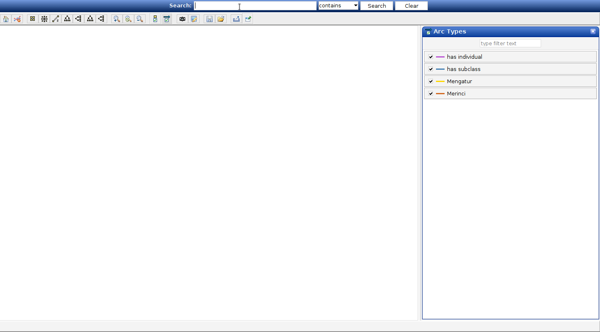

## Ontologi Regulasi

Ini adalah proyek terbuka yang bertujuan untuk memetakan regulasi yang ada di Indonesia melalui pembuatan OWL Ontology. Nantinya akan dibuat beberapa ontologi terkait dengan topik tertentu di bidang hukum. Adapun untuk awalan, kami akan mencoba menyusun ontologi berkenaan dengan hukum perpajakan.

## Latar Belakang

- Regulasi Indonesia yang sangat banyak dan tersebar.
- Potensi adanya overlap pengaturan antar peraturan.
- Belum ada cara mudah untuk melihat kerangka regulasi di Indonesia secara utuh.

## Perangkat

Peralatan yang digunakan dalam proyek ini adalah aplikasi [Protege](https://protege.stanford.edu/) yang dibuat oleh Standford University.

## Daftar Ontologi

Daftar ontologi yang sudah dibuat:

| Deskripsi                          | Versi | Link        |
|------------------------------------|-------|-------------|
| Ontology Ketentuan Umum Perpajakan | 1.0.0 | Coming Soon |
| Ontology Pajak Pertambahan Nilai   | 1.0.0 | Coming Soon |

## Tim

- Bakhtiar Amaludin
- Fitria Ratna Wardika
- Gede Yudi Paramartha
- Achmadaniar Anindya Rosadi
- Putu Jasprayana M.P.
